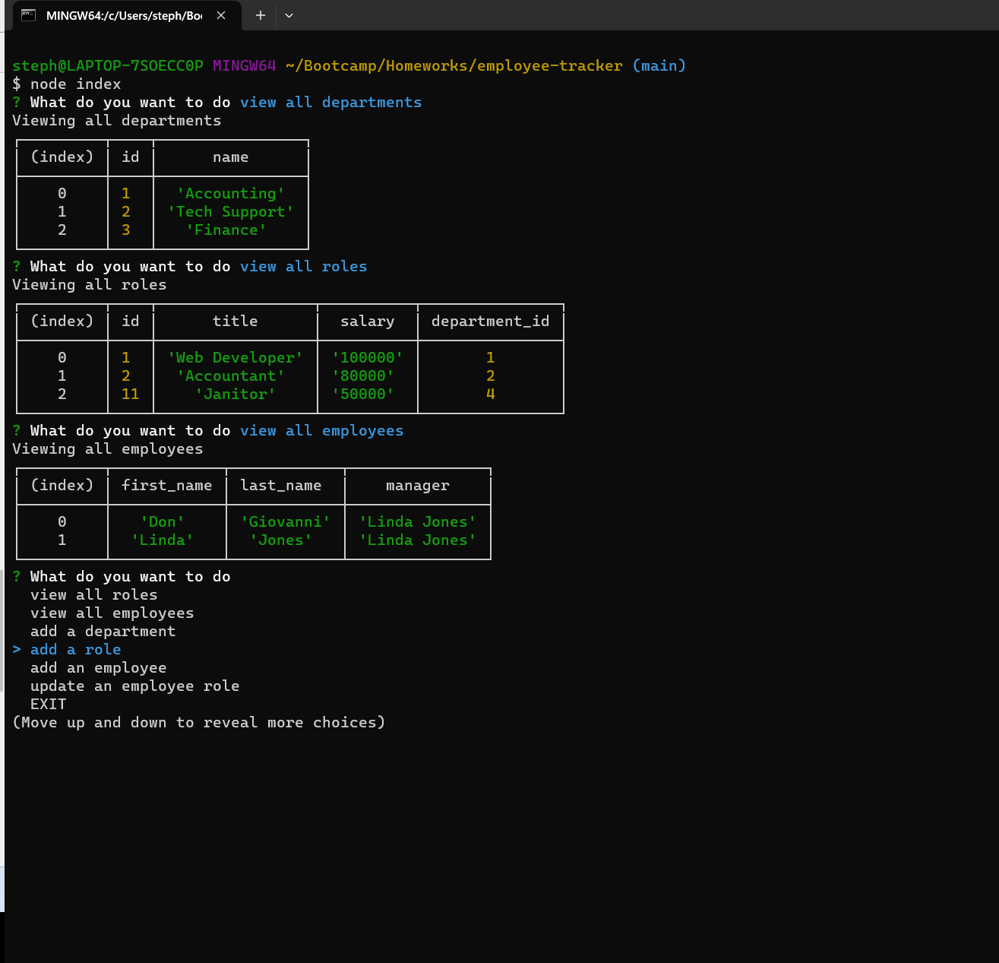

# Employee Tracker

## This application allows management to easily keep track of all employees, departments, and roles. It also allows management to dynamically update them. This app lets companies save time and effort.

## To install this app you must clone the github repository to wherever on your computer you would like.

## To use navigate to where you cloned the repo. In the command line run npm i and then node index. After that use the arrow keys to select what you want to do and follow the prompts from there. 
